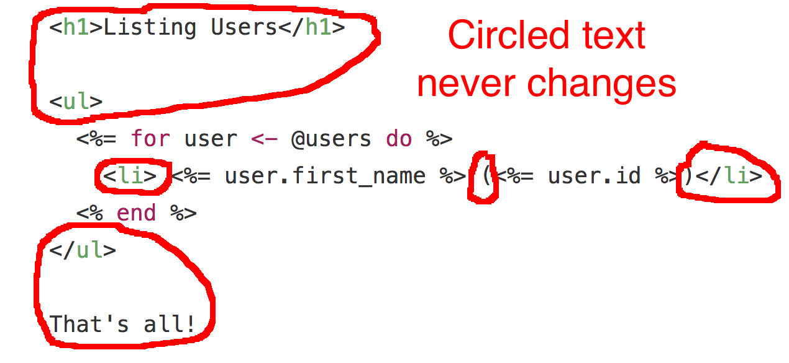

class: center, middle

# Elixir &amp; the Phoenix Framework

## Frederick Web Tech<br>February 2017

Matt Layman [@mblayman](https://twitter.com/mblayman)

???

No, not the name of the latest Harry Potter novel.

---

class: center

# 150 &rArr; 5

???

http://www.techworld.com/apps/how-elixir-helped-bleacher-report-handle-8x-more-traffic-3653957/

> On our monolith we needed roughly 150 servers to power the more intensive
portions of BR. Following our move to Elixir we're now able to power those
same functions on five servers and we're probably overprovisioned.
We could probably get away with it on two

* No caching
* No autoscaling and 8x load (bottlenecked at db)

--


---

class: center, middle

# 30x!!

---

class: center, middle

# HOW?

???

...

---

class: center, middle

# BEAM

???

Bogdan/Björn's Erlang Abstract Machine

* The virtual machine powering Erlang. First appearing in 1992.
* Chat about VMs. Java, Python, Ruby, C#
* Concurrent execution to run on all cores.
* 9 9s of uptime. 99.9999999%. <1s in 20 years.

https://pragprog.com/articles/erlang

---

class: center, middle

## Erlang?<br>I thought this was about Elixir.

???

It is. Elixir is a new language that compiles to the BEAM.
It's the cool younger sibling of Erlang.

* Elixir started in 2011.
* Talking about BEAM to emphasize stability.

---

## How is the BEAM so magical?

--

* How do I write "concurrent" code?
--

* I wrote a threaded program before and wanted to gouge my eyes out.

???

Is writing Elixir going to make me hate everyone and everything?

--

### Key elements

* Functional Programming
???

Code has defined inputs and outputs with minimal side effects

--

* Actor Model

???

* Threaded model: communicate by sharing state (hence locks)
* Actor model: share state by communicating

---

## Contrast with Python

--

* A threaded program in Python will be slower than a non-threaded one.
???

Thanks to the GIL

--

* A program can create multiple processes
???

These are slow to create because of fork/exec

--

### Languages like Python were not designed with concurrency as a core primitive

???
Forces third party software like Celery/Redis/ZeroMQ for inter-process communication.

---

class: center, middle


---

## Phoenix

* Most popular web framework in the Elixir community
???

The Rails of Elixir.
1 of 2 project driving adoption of Elixir. The other being Nerves.

--

* Server rendered pages
???

ERB comparison

--

* Strong websocket support
???

Talk about pipelines and compare with Django.

--

* Integration with Brunch... because JavaScript exists whether you like it or not

---

class: center, middle

## Template Tricks



???
`writev`

https://www.bignerdranch.com/blog/elixir-and-io-lists-part-2-io-lists-in-phoenix/

---

## Danger!<br>Serious Computer Science Ahead

--

# CRDTs

???

Context free replicated data types

---

class: center, middle

## Brunch


???

Not a task runner. A bundle builder

---

class: center, middle

# Demo

---

# Install

```bash
$ brew install elixir
$ mix local.hex
$ mix archive.install \
    https://github.com/phoenixframework/archives/raw/master/phoenix_new.ez
```

--

Sorry, I can&rsquo;t really speak to Elixir&rsquo;s deployment story.

---

class: center, middle

# Thank you

Matt Layman [@mblayman](https://twitter.com/mblayman)

[mattlayman.com](http://www.mattlayman.com)
